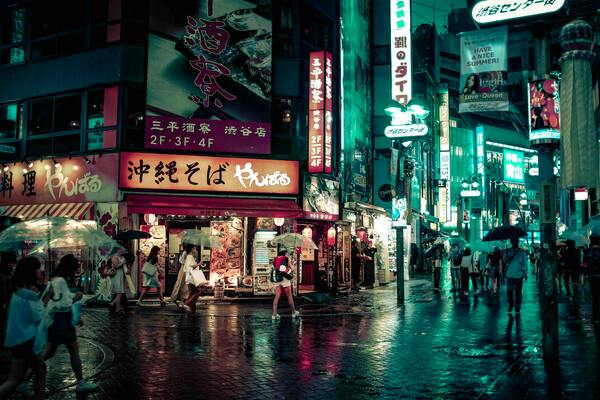

# Tokyo Night Theme

A dark, neon-accented theme for quicklock based on the [Tokyo Night](https://github.com/folke/tokyonight.nvim) palette.

## Colors

| Property | Color | Usage |
|---|---|---|
| `bg` | `#1a1b26` | Background |
| `textPrimary` | `#c0caf5` | Clock, date, password |
| `textStatus` | `#e0af68` | Status messages |
| `textSecondary` | `#7aa2f7` | Fingerprint subtitle |
| `textMuted` | `#9ece6a` | Hint text |
| `textHint` | `#bb9af7` | Labels |
| `error` | `#f7768e` | Auth failure |
| `spinnerStroke` | `#7dcfff` | Loading spinner |

## Wallpaper



## Usage

Edit `config.json`:

```json
{
  "theme": "tokyonight"
}
```

